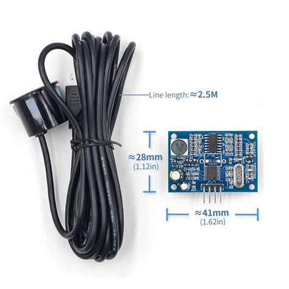

# jsn-srt04t
Python code example for the JSN-SR04T waterproof ultrasonic sensor

Ultrasonic distance sensor waterproof Product Features

Model:  JSN-SR04T

Operating voltage:  DC 3 ~5.5V

Quiescent current:  < 8mA

Acoustic emission frequency:  40khz

Farthest range: 600cm

Recent range: 20cm

Distance measurement accuracy: ± 1cm

Resolution: 1mm

Measuring angle: 75 degrees

Input trigger signal: TTL pulse above 10uS

Serial send command: 0X55

Output echo signal: Output pulse width level signal, or TTL

3-5.5V (power positive)

Trig (RX) RX

Echo (output) TX

GND (power supply negative

Product Size: L42 * W29 * H12 mm

Working temperature: -20 ℃ - +70 ℃

Product color: PCB board is blue
